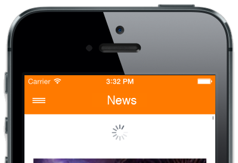
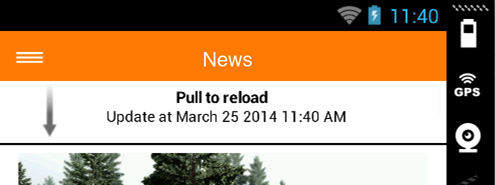
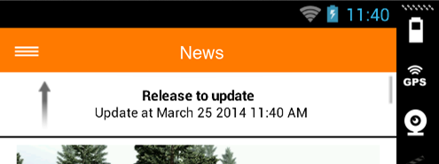
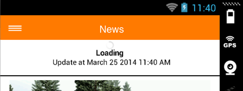

# Alloy PullToRefresh

## Description
The Titanium ALloy **Badass PullToRefresh** widget allows to refresh the page with a pull down when using a **ListView**. 
Available for **iOS and Android**, without any dependencie.
For iOS we use [the native refreshControl](http://docs.appcelerator.com/titanium/3.0/#!/api/Titanium.UI.RefreshControl), and for Android it's a custom pull to refresh. The header pull view is personalizable.

## Overview

## Installation

### Manual install
1. Download this widget and put it in the folder `app/widgets`
2. Declare the depedency in the `app/config.json` file:
	
		"dependencies": {
        	"com.jolicode.pullToRefresh": "1.0"
   	 	}
    
### Gittio install
You can use the command line: (need [gitt.io](http://gitt.io/) installed)

		$ gittio install com.jolicode.pullToRefresh

## Configuration

In your principal controller:

* In the `xml` file, where there will be your listView put this code: 

		<Widget src="com.jolicode.pullToRefresh" id="pulltorefresh"/>
		
* In the initialization of the `js` file put this code: 
	
		$.pulltorefresh.initialize({
        	controller: 'homepage/listView',
        });
        
	This is the minimal code you have to implement. 

	| Option       | Signification                                    |
	| ------------ |:------------------------------------------------:|
	| `controller` | Emplacement of the controller of your ListView   | 

	But you can add these parameters :
	
	* `iosRefreshControl`[Optional], that represents several properties of the native refresh control, that is specific to iOS's devices:

		| Option        | Signification                   | Type            | Default     | Documentation                 |
		| ------------- | ------------------------------- |:---------------:|:-----------:|-------------------------------|
		|`tintColor`    | Color of the refreshControl     | String          | black       |[Ti.UI.RefreshControl](http://docs.appcelerator.com/titanium/3.0/#!/api/Titanium.UI.RefreshControl)|
		|`title`        | Attributes of the title         | AttributedString| none        |[Ti.UI.iOS.AttributedString](http://docs.appcelerator.com/titanium/3.0/#!/api/Titanium.UI.iOS.AttributedString)|

	* `headerPullView`[Optional], that represents several properties specifics to Android's devices:

		
		| Option        | Signification                   | Type            | Default     |
		| ------------- | ------------------------------- |:---------------:|:-----------:|
		||
		| ***view***                                                                      | 
		|  `size`       | size of the view                | Number/String   | 60          |
		| `backgroundColor`| background color of the view | String          | "FFF"       |
		||
		| ***border***                                                                    | 
		| `height`      | height of the border            | Number/String   | 2           |
		| `backgroundColor`| background color of the border| String         | "black"     |
		||
		| ***arrow***                                                                     |
		| `backgroundImage`| path to your arrow image     | String          | WPATH("/image/arrow.png")|
		| `bottom`      | margin bottom up to the border  | Number/String   | 7           |
		| `height`      | height of the arrow             | Number/String   | 45          |
		| `left`        | margin left of the arrow        | Number/String   | 35          |
		| `width`       | width of the arrow              | Number/String   | 11          |
		||
		| ***indicator***                                                                 |
		| `bottom`      | margin bottom of the refresh indicator| Number/String | "auto"  |
		| `left`        | margin left of the refresh indicator| Number/String  | "auto"   |
		| `right`       | margin right of the refresh indicator| Number/String   | "auto" |
		| `top`         | margin top of the refresh indicator| Number/String   | 0        |
		||
		| ***status***                                                                    |
		| `bottom`      | margin bottom of the label      | Number/String   | 30          |
		| `color`       | color of the label              | String          | "black"     |
		| `height`      | height of the label             | Number/String   | "auto"      |
		| `font`        | font of the label               | Font            | { fontSize: 12, fontWeight: "bold" }|
		| `textAlign`   | text alignment of the label     | String/Number   | "center"    |
		| `width`       | width of the label              | Number/String   | 200         |
		||
		| ***lastUpdate***                                                                |
		| `bottom`      | margin bottom of the label      | Number/String   | 15          |
		| `color`       | color of the label              | String          | "black"     |
		| `height`      | height of the label             | Number/String   | "auto"      |
		| `font`        | font of the label               | Font            | { fontSize: 12 }|
		| `textAlign`   | text alignment of the label     | String/Number   | "center"    |
		| `width`       | width of the label              | Number/String   | 200         |
		
		
* In the `js`file of yout listView:
	* In the initialization of the file put this code: 
	
	        if (args.pulltorefresh) {
           		args.pulltorefresh.setCallback(api.doRefresh);
        	}
	
	* In the function where you update your view you have to put this code:
		
			if (args.pulltorefresh && data) {
           		args.pulltorefresh.stop(data.length * 240, 20);
			}
			
		The first argument is the length of one item of your listView.
		
		The second argument [Optional] is the subtraction of the size of the header by the size of the navbar, if you don't have any navbar don't indicate this argument.
			
	* Add this function: 
	
			doRefresh: function(e) {
        		// Call your updateListView function
    		},

## Internationalization

This widget can be in multiples languages, that's there are 4 keys you have to indicate the string phrases :
	
1. loading
2. release_to_update
3. pull_to_reload
4. updated_at

You can for example put this code in your `/i18n/en/string.xml` file: 
  	
  	<string name="loading">Loading</string>
  	<string name="release_to_update">Release to update</string>
  	<string name="pull_to_reload">Pull to reload</string>
	<string name="updated_at">Update at</string>
	
You can find the same example in french in the widget file `i18n/fr/string.xml-dist`.

For more info in internationalization and i18n look the [documentation](http://docs.appcelerator.com/titanium/3.0/#!/api/Titanium.Locale-method-getString).

## Examples

	var refreshTitle = null;

    if (OS_IOS) {
        var text = "Hello people, it's a text for the refresh control, yeahhhhh ça rocks du poney !";
        refreshTitle = Titanium.UI.iOS.createAttributedString({
            text: text,
            attributes: [
                {
                    type: Titanium.UI.iOS.ATTRIBUTE_BACKGROUND_COLOR,
                    value: "red",
                    range: [text.indexOf('poney'), ('poney').length]
                },
            ]
        });
    }

    $.pulltorefresh.initialize({
        controller: 'homepage/listView',

        iosRefreshControl: {
            tintColor : '#FF7A00',
            title: refreshTitle,
        },

        headerPullView : {
            arrow : {
                backgroundImage: "/images/arrow.png",
                bottom: 10,
                height: 46,
                left: 35,
                width: 11
            },
            border : {
                backgroundColor: '#FF7A00',
                height: 3
            },
            indicator : {
                top: 1
            },
            lastUpdate : {
                color: "#FF7A00",
            },
            status : {
                color: '#FF7A00',
                font: {
                    fontSize: 15,
                    fontWeight: "bold"
                },
            },
            view : {
                backgroundColor: 'grey',
                size : 70
            }

        }    
    });
    
    
